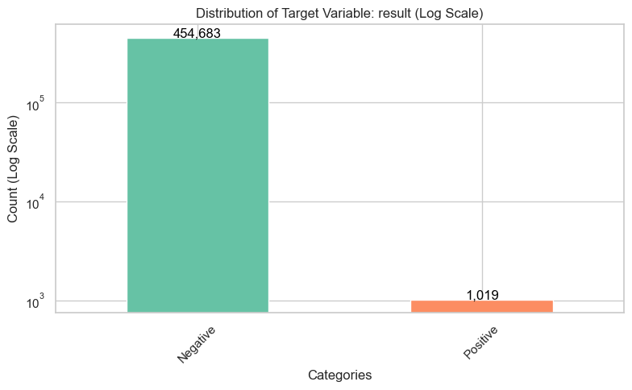
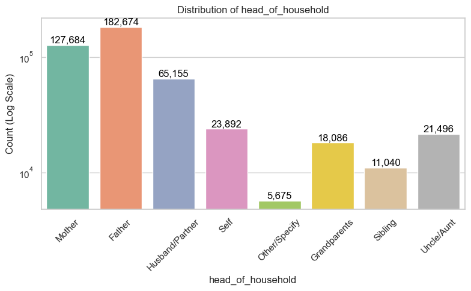
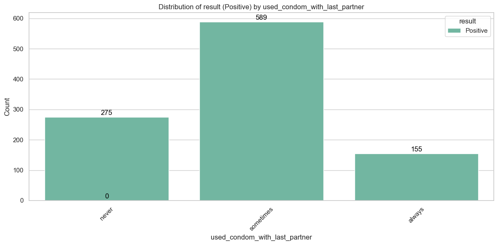
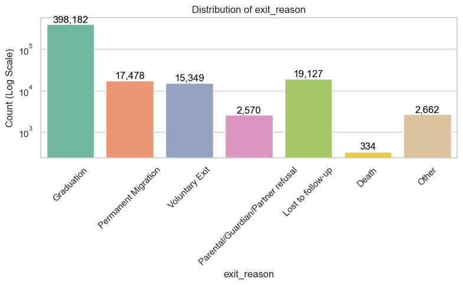
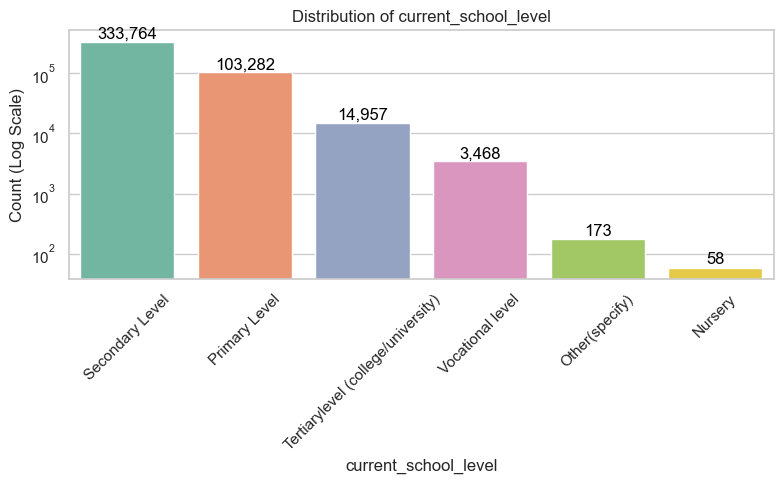
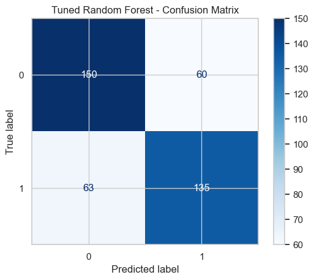

# Predicting HIV Risk and Identifying Key Infection Drivers among Adolescent Girls and Young Women in Kenya

## Table of Contents

- [Project Overview](#overview)
- [Business Understanding](#business-understanding) 
- [Data Understanding](#data-understanding)
- [Exploratory Data Analysis (EDA)](#exploratory-data-analysis-eda)  
- [Modeling](#modeling)  
- [Key Takeaways](#key-takeaways-from-our-analysis)  
- [Recommendations](#recommendations)  
- [Future Improvements](#future-improvements)  
- [Tech Stack & Dependencies](#tech-stack--dependencies)  

# Overview

According to HIV & AIDS world outlook reports highlights HIV as the biggest global health issue with approximately 38 million infected worldwide(WHO(2020), UNAIDS(2020)).The disease mostly affects adolescent girls and young women (AGYW), who are at a higher risk of HIV infection due to a combination of biological, socio-economic, and behavioral factors (WHO(2020), UNAIDS(2019)).

Regionally, sub-Saharan Africa is bearing the bulk of the epidemic and bears nearly 70% of the world's HIV cases (WHO(2020), UNAIDS(2019)).

Locally in Kenya, HIV remains a significant public health issue among AGYW relative to their counterparts who are male. Structural impediments such as gender disparities, levels of poverty, and limited access to education and health care leave AGYW in some of the counties vulnerable to increased vulnerability (National AIDS Control Council, 2020; Ministry of Health Kenya, 2021). Despite interventions such as the Aid-Funded programs that seek to stem HIV infections by surmounting these structural drivers, the challenge of reaching high-risk groups and utilizing existing resources to the fullest for intervention still exists.This research will, therefore adopt Cross Industry Standard Procedures- Data Mining(CRISP-DM) methodology for the health industry.

# Business Understanding
## Problem Statement
Adolescent girls and young women (AGYW) in Kenya face a disproportionately high risk of HIV infection, accounting for nearly 70% of new cases in sub-Saharan Africa. Despite interventions like the SPARK program—which targets structural drivers such as poverty, gender inequality, and lack of education—critical challenges persist:
  - Inefficient Resource Allocation: Limited ability to identify and prioritize high-risk populations.
  - Gaps in Intervention Impact: Uncertainty about which strategies (biomedical, behavioral, or social) are most effective.
  - Data-Driven Decision-Making: Need for actionable insights to optimize program reach and reduce HIV incidence.

This project addresses these challenges by leveraging data science to predict risk, evaluate interventions, and guide evidence-based policy decisions.

### Key Stakeholders
|Stakeholder	            |      Interest                                        |
|---------------------------|------------------------------------------------------|
|Public Health Agencies     | Reduce HIV incidence, measure program ROI.           |
|NGOs & Program Coordinators| Improve intervention targeting and scalability.      |
|Policymakers               | Design policies backed by data-driven insights.      |
|Healthcare Providers       | Identify at-risk individuals for early intervention. |

### **Objectives:**
1. Predict HIV Risk: Develop a machine learning model to estimate HIV risk based on demographics, behavior, and program exposure.
2. Identify Risk Factors: Use feature importance techniques to highlight contributors to HIV vulnerability.
3. Assess Interventions: Evaluate the impact of biomedical, behavioral, and social protection interventions.
4. Optimize Resource Allocation: Provide actionable insights to improve program targeting and service delivery.

# Data Understanding
## 1. Dataset Overview
- Source: SPARK (Strengthening Prevention and Awareness for Resilient Communities) program data (2018–2022).
- Size: 455,807 records × 42 features (pre-cleaning).

***Key Variables:***
  - Demographics: Age, county, household structure, parental status.
  - Socioeconomic: Household size, income sources, food security.
  - Behavioral: School attendance, sexual activity, condom use.
  - Medical: HIV testing history, test results (result: 99.8% negative, 0.2% positive).
  - Interventions: Participation in biomedical (e.g., HTS testing), behavioral, and social programs.

## 2. Data Quality & Cleaning
**Key Issues Identified:**
  1. Missing Values:
- High missingness (>80%) in columns like dreams_program_other and exit_reason_other (dropped).
- Moderate missingness in critical features: county (2%), currently_in_school (0.9%), ever_had_sex (1.7%).
- Resolution:
  - Numerical columns imputed with median (e.g., age_of_household_head).
  - Categorical columns filled with mode (e.g., county → "Nairobi").
 2. Class Imbalance:
   - Severe imbalance in target variable (result): 99.8% HIV-negative, 0.2% HIV-positive.
   - Resolution: SMOTE (Synthetic Minority Oversampling) applied during modeling to balance classes.
 3. Outliers:
   - Extreme values in age_of_household_head (max = 727 million due to data entry errors).
   - Resolution: Replaced outliers with median values.

# Exploratory Data Analysis (EDA)
   - Vizualizing the distribution of the target variable: 99% are Negative cases while  1% consists of positive cases. 

  - Demographics: 72% of participants lived in households headed by parents.

 

- Behavioral Trends:
42% used condoms inconsistently with their last partner.

- Impact of the health program: Graduation emerges as the frontrunner exit reason at an impressive 398,182, overshadowing the next largest categories—lost to follow-up, permanent migration, and voluntary exit—while death and other reasons remain minimal, underscoring a strong program completion rate and highlighting targeted areas for improvement.

- Current education level

# Modeling 
## 1. Approach

*Objective:* To build a classification model to predict HIV risk (binary: Positive/Negative) and identify key drivers of infection.

*Framework:* We employed the CRISP-DM methodology for a structured and iterative data mining process.

 **Model Selection**
- Logistic Regression: Baseline model for interpretability and benchmarking.
- Random Forest: Handles non-linear relationships and feature interactions; robust to outliers.
- XGBOOST: Gradient-boosted tree model optimized for accuracy and speed; handles class imbalance effectively.

  **class Imbalance Mitigation**
SMOTE (Synthetic Minority Oversampling): Generated synthetic HIV-positive samples to balance the target variable (0.2% → 50% representation).

## 2. Preprocessing Pipeline

**Feature Engineering:**
- Derived age from date_of_birth and date_of_enrollment.
- Binned age_at_first_sexual_encounter into categories (<15, 15–17, 18+).

**Encoding:**
- One-hot encoded categorical variables (e.g., county, current_income_source).
- Scaling: Standardized numerical features (e.g., household_size) for Logistic Regression.

## 3. Model Training & Tuning
**Data Splitting**

Train/Test Split: 80% training, 20% testing (stratified to preserve class balance).

**Hyperparameter Tuning**
- GridSearchCV: Optimized parameters across 5-fold cross-validation.
- Logistic Regression: Penalty (l1, l2), regularization strength (C).
- Random Forest: n_estimators (100–500), max_depth (5–20), min_samples_split (2–10).
- XGBoost: learning_rate (0.01–0.2), max_depth (3–10), subsample (0.6–1.0).

## 4. Evaluation Metrics

|Metric	    |Importance                                                         |
|-----------|-------------------------------------------------------------------|
|Recall	    |Prioritize identifying true positives (critical for HIV prevention)|
|Precision	|Avoid overloading resources with false positives.                  | 
|F1-Score	|Balance precision and recall for imbalanced data.                  |

## 5. Results
1. Baseline Models (Imbalanced Data)

|Model	               |Accuracy   |Precision |Recall	|F1-Score	|Observation
|----------------------|-----------|----------|---------|-----------|--------------------------------|
|Logistic Regression   |71.25%	   |0.49%	  |64.18%	|0.98%	    |Biased toward the negative class;poor F1.      
|Random Forest	       |99.75%	   |0.00%	  |0.00%	|0.00%	    |Severe overfitting; predicted all  negatives.
|XGBoost	           |99.78%	   |0.00%	  |0.00%	|0.00%	    |Same as Random Forest.

2. Undersampled Balanced Data

|Model	                |Accuracy	|Precision |Recall	|F1-Score |Observation|
|-----------------------|-----------|----------|--------|---------|------------|
|Logistic Regression	|67.16%	    |66.49%	   |65.15%	|65.82%	  |Balanced performance.|
|Random Forest	        |65.44%	    |64.77%	   |63.13%	|63.94%	  |Moderate improvement over baseline.|
|XGBoost	            |61.76%	    |60.19%	   |62.63%	|61.39%	  |Lowest accuracy but better recall    than RF.

3. Hyperparameter Tuning Results

|Model	              |Accuracy	|Precision	|Recall	|F1-Score  |Key Tuning Parameters|
|---------------------|---------|-----------|-------|----------|----------------------|
|Logistic Regression  |69.61%	|68.88%	    |68.18%	|68.53%	   |C=10, max_iter=100, solver='liblinear'
|Random Forest	      |69.85%	|69.23%	    |68.18%	|68.70%	   |max_depth=20, min_samples_leaf=1, n_estimators=200
|XGBoost	          |48.53%	|48.53%	    |100%	|65.35%	   |scale_pos_weight=50, learning_rate=0.01, max_depth=3, subsample=0.7

# Key Takeaways from Our Analysis
**Dealing with Class Imbalance**

Our initial models struggled due to extreme class imbalance, defaulting to trivial "Negative" predictions. Basically, they weren’t learning anything useful—just playing it safe.

**What Worked?**

Undersampling Helped: Once we balanced the data, recall and F1-score improved significantly.

Logistic Regression Stood Out: Among the baseline models, it performed the best on the balanced dataset.

**Tuning Results**

Random Forest - Best Overall: Achieved a solid balance between accuracy (69.85%) and F1-score (68.70%).

The confusion matrix below illustrates the performance of the tuned Random Forest model. It correctly predicted 150 HIV-negative and 135 HIV-positive cases, but misclassified 60 false positives and 63 false negatives. While overall accuracy is strong, the false negative rate suggests room for improvement to reduce missed high-risk cases. 

XGBoost - High Recall, But Risky: It caught every single positive case (100% recall) but at the cost of very low precision (48.53%). This means a high false positive rate, which could be a problem depending on the use case.

### Key Features Identified (Random Forest Insights)
- Age at First Sexual Encounter: Early onset correlates with higher risk.
- Household Food Security: Food insecurity increases risk by 2.1×.
- Education Level: Lower educational attainment linked with a 1.8× increase in risk.
- Condom Use: Inconsistent use reflects a 1.5× higher risk scenario.

# Recommendations
- Targeted Outreach: Deploy mobile testing units in high-risk counties like Nairobi and Kisumu.

- School-Based Initiatives: Fuse sexual health education with conditional cash transfers to boost engagement and reduce risk.
- Household-Level Support: Launch community kitchen programs to combat food insecurity head-on.
- Partner Engagement: Enhance male partner testing protocols in regions with significant age disparities.

# Future Improvements

Feature Engineering: Test interactions (e.g., age + behavioral factors) or explore temporal trends.

Better Data: Collect more positive cases or integrate external datasets to improve class balance.

Model Enhancements: Experiment with Neural Networks and Incorporate spatial analysis for geo-targeting.

## Tech Stack & Dependencies
Python 3.8+

Libraries: pandas, scikit-learn, xgboost, numpy, matplotlib

Models Employed:
- Logistic Regression
- Random Forest
- XGBOOST

## Resources
Data - [Download Processed Data](https://github.com/RichieRicky/DSF-PT08P5-GROUP5_CAPSTONE-PROJECT/raw/refs/heads/main/dreams_raw_dataset.zip)

Notebook - [Open Notebook](https://github.com/RichieRicky/DSF-PT08P5-GROUP5_CAPSTONE-PROJECT/blob/main/Index.ipynb)